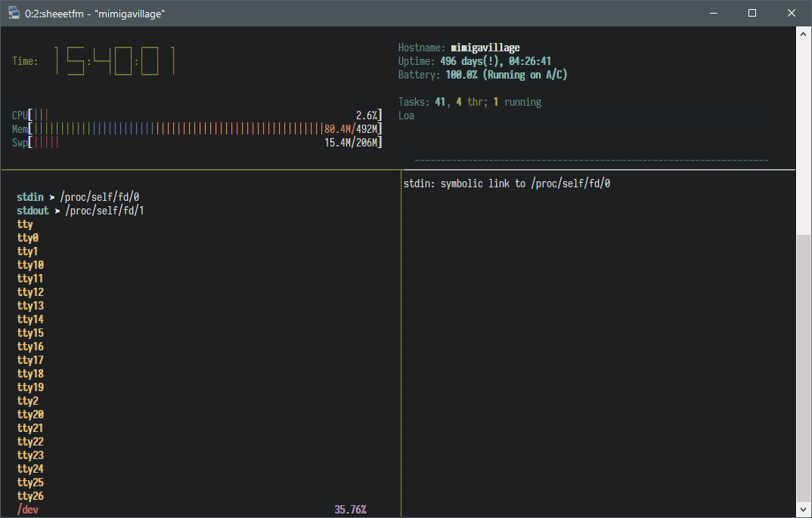

# Disclaimer

This probably isn't for you. Don't bash on me if you see spaghetti code.

# The problem

The CLI file manager [ranger](https://github.com/ranger/ranger) was using too much memory for my taste
on [my humble little server](https://about.gandas.us.to/): around 8M out of the 512M.

# The solution

Write a simpler file manager, with less features granted, to replace it; currently it's
using around 100K to 300K.

# Installing / Uninstalling

This program depends on [termbox](https://github.com/nsf/termbox), and, temporarily,
on [libmill](https://github.com/sustrik/libmill).

```
$ sudo make install clean
$ sudo make uninstall
```

# Usage

Open `sheeetfm` and `sheeetfmd` in two different terminals (or split tmux panes);
browse with `hjkl` like in vim, or use the arrow keys; input commands with `:`,
namely `!<shell command> %s`, where `%s` is the currently selected file, `cd <dir>`,
and `s <search term>`.

The shortcuts for these are, respectively, `!`, `c` and `s`. You can also return to
your home directory with `H`, list hidden files with `.`, refresh the file list with
`r`, and clean the `sheeetfmd` pane with `^L`.

# Final notes

* Thanks to [suckless](https://suckless.org/) for `arg.h`
* Yes, the **eee** comes from EEE PC

# License

Do whatever the fuck you want with it™.
